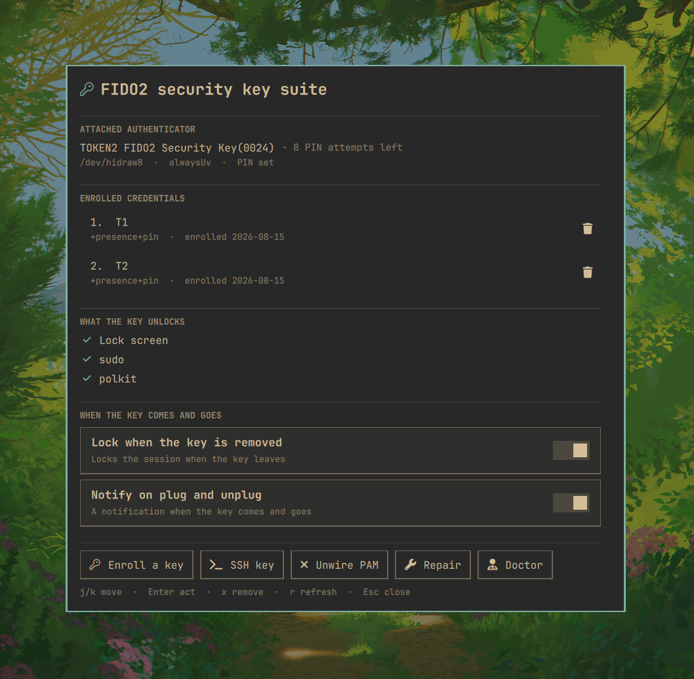

# FIDO2 Security Key Suite

Omarchy's built-in _Setup > Security > Fido2_ covers `sudo` and system
authorization prompts, not unlocking your computer. This plugin extends the key
to the lock screen and to SSH, and adds a panel to manage it from the shell.



## What it does

| | |
|---|---|
| Lock screen | Unlock with the key: touch, or PIN + touch where the key demands it. Password is one `Tab` away. |
| `sudo` and polkit | A touch on the key instead of a typed password. |
| Multiple keys | A daily key and a backup, each labelled, each removable on its own. Stock Omarchy registers one and stops. |
| Management panel | Enrolled credentials, the attached key and its PIN retries, what the key unlocks, settings. |
| Bar widget | Key glyph, lit while a key is attached. Click opens the panel. |
| Lock on unplug | Opt-in: pulling the key out locks the session. |
| SSH keys | `ed25519-sk` keys whose private half stays on the authenticator, plus the commit-signing config. |
| Doctor | Checks the whole chain and names the fix for each failure. |

Works with any FIDO2/U2F authenticator — YubiKey, Token2, Nitrokey, SoloKeys —
through `pam_u2f`, including CTAP 2.1 keys that enforce `alwaysUv`.

## Install

```bash
sudo pacman -S --needed pam-u2f libfido2
omarchy plugin add https://github.com/Erijl/omarchy-fido2-key-suite.git --enable
~/.config/omarchy/plugins/erijl.lock/bin/omarchy-fido2-suite enroll
omarchy restart shell
```

`enroll` registers the key, writes the lock screen's PAM service, and offers to
put the key in front of `sudo` and polkit too. Register a second key while you
still have the first — losing your only credential takes all three with it.

`omarchy plugin remove erijl.lock` puts the built-in lock screen back. Run
`bin/omarchy-fido2-suite disable` first if you also want PAM unwired.

## Use it

- **Panel** — click the key glyph on the bar, or `omarchy-shell shell summon
  erijl.lock '{}'`. Its buttons run the commands below in a floating terminal;
  the shell itself never runs anything privileged and never talks to the key.
- **Lock screen** — starts on the key when one is enrolled and plugged in.
  `Tab` or the pill under the field switches between key and password; `Enter`
  on an empty field tries the key again.
- **Command line** — everything the panel does is a command, and every command
  works on its own:

| Command | |
|---|---|
| `enroll [label]` | register a key (only one attached at a time) |
| `list` / `remove [n]` | what is enrolled; drop one credential |
| `enable` / `disable` | wire the key into `sudo` and polkit, or unwire it |
| `ssh [name] [--resident]` | mint an SSH key held on the authenticator |
| `repair` | fix an installation the stock Omarchy flow made |
| `status` / `doctor` | where things stand; check every link in the chain |

---

## Details

### Will it work with your key?

Yes, unless your key enforces CTAP 2.1 `alwaysUv` (Token2, or any key you turned
it on for) — then unlocking is PIN, then touch, and the credential needs a
verification flag the stock Omarchy flow does not write. `enroll` reads the
key's CTAP options and records the right one, `repair` fixes an installation
_Setup > Security > Fido2_ already made, and
[basecamp/omarchy#6912](https://github.com/basecamp/omarchy/pull/6912) fixes it
upstream.

### The panel and the bar widget

The panel shows the attached authenticator and the PIN attempts it has left,
every enrolled credential with its flags and enrolment date, and which of the
lock screen, `sudo` and polkit the key currently unlocks. Actions open a
floating terminal running `bin/omarchy-fido2-suite`, the same idiom Omarchy's
own Setup > Security entries use: you see the command, answer its prompts, and
type your own sudo password.

The bar widget is the key glyph the lock screen uses — lit while a key is
attached, dim while none is, click to open the panel. `omarchy bar put
erijl.lock` adds it to an installation that predates it.

### When the key comes and goes

Two settings on this plugin's entry in `shell.json`, both off by default and
both toggleable from the panel:

| Setting | What it does |
|---|---|
| `"lockOnUnplug": true` | Locks the session the moment the key leaves the machine. |
| `"notifyOnKeyChange": true` | A notification when the key comes and goes. |

Either one — or the bar widget being on the bar — keeps the service watching for
the key while the session is unlocked. With all three off it only looks while
the lock screen is up, which is the only time it otherwise needs to know.

An unplug has to be seen twice before it counts: a key busy answering an
enrollment in a terminal can miss an enumeration, and that must not lock the
screen mid-PIN.

### SSH keys on the authenticator

`ssh [name]` mints an `ed25519-sk` key whose private half never leaves the
authenticator, then prints the three `git config` lines that sign your commits
with it. A resident key (`--resident`, or answer yes when asked) is stored on
the authenticator itself and can be pulled back out on another machine with
`ssh-keygen -K`, at the cost of one resident slot.

The key's CTAP options are read here too: a key that mandates user verification
gets `verify-required` recorded on the credential, so `ssh` never hands it an
assertion it refuses.

### Using the lock screen

Starts on the key when one is enrolled and plugged in, on the password
otherwise. A key plugged in while locked switches modes, unless you have started
typing.

| Input | Password mode | Key mode |
|---|---|---|
| `Tab`, or the pill under the field | switch to the key | switch to the password |
| `Enter` on an empty field | — | try the key again |
| the key glyph in the field | switch to the key | try again |

In key mode the field is inert until `pam_u2f` asks for a PIN, so a PIN cannot
be typed into the void or leak into the password flow. A failed attempt never
retries by itself — each one can cost one of the key's PIN retries.

Optional `"defaultMode"` on the same `shell.json` entry: `auto` (default),
`password` to never start on the key, `security-key` to always.

### Why the key gets its own PAM service

The shortcut is `auth sufficient pam_u2f.so` in `omarchy-lock-password`, with no
code changes, and it appears to work: the lock plugin answers every PAM prompt
from the same buffer, so your PIN satisfies `pam_u2f` while your password fails
`pam_u2f` and then satisfies `pam_unix`. Both unlock.

But on that second path your password was spent as a PIN attempt, and the key's
retry counter went 8 → 7. Eight absent-minded unlocks and the key locks itself
out permanently; recovery is a factory reset that destroys every credential on
it. Hence its own service, its own `PamContext`, and an explicit mode: a PIN is
only ever sent when you asked for the key.

```
auth       required    pam_u2f.so authfile=/etc/fido2/fido2 cue [cue_prompt=Touch your security key]
account    include     system-local-login
```

`required` with no `pam_unix` fallback — the way back to a password is the mode
switch, not a silent fall-through. No `pinverification=1`: that module option is
ORed with the per-credential flag, so it would force a PIN onto keys enrolled
without one.

### When it does not work

```bash
~/.config/omarchy/plugins/erijl.lock/bin/omarchy-fido2-suite doctor
```

Checks which lock service is actually running, the plugin's surfaces, PAM,
credentials, file ownership, what your attached key reports, your SSH keys, and
whether Omarchy's built-in lock plugin has moved since this fork. Every failure
names its own fix.

### Maintaining it

The lock screen is a fork of `omarchy.lock`, declared via the manifest's
`clonedFrom` so enabling this plugin steps the built-in aside. Upstream fixes do
not arrive by themselves. `upstream/lock/` holds the built-in's files at the forked
revision plus their hashes, making drift a hash compare and a re-base a
three-way merge:

```bash
bin/omarchy-fido2-suite doctor   # says when the built-in has moved
bin/omarchy-fido2-suite rebase   # merge onto the new built-in
./test/all                       # manifest, qmllint, behaviour, fork base
```

**Run `omarchy restart shell` after any `omarchy plugin update`.** The shell
hot-reloads a plugin's entry point but keeps the compiled component for its
other files, so an updated `LockView.qml` goes on drawing the old version — with
a log line claiming it reloaded, and no error anywhere.

## License

`Service.qml` and `LockView.qml` are derived from Omarchy's built-in lock
plugin, © David Heinemeier Hansson, MIT; the FIDO2 additions are MIT too. See
[LICENSE](LICENSE).
